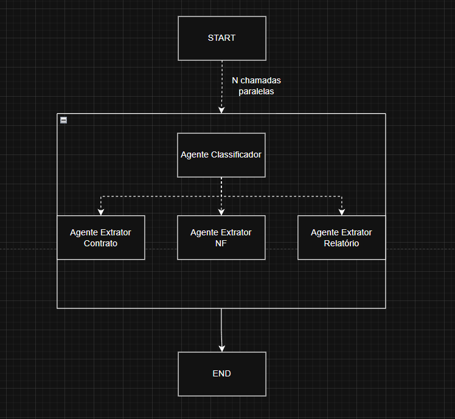

## Agentic OCR

Aplicacao de OCR estruturado que classifica documentos PDF e extrai dados de
contratos, relatorios e notas fiscais usando agentes LangGraph e OpenAI.

### Requisitos

- `uv`
- Uma chave da API da OpenAI
- Credenciais do Langfuse, se quiser observabilidade

### Configuracao

Na raiz do projeto, execute:

```powershell
uv sync
```

Esse comando criará o ambiente virtual e instalará as dependencias, 

Crie um arquivo `.env`
Copie as variáveis do arquivo `.env.example` para o `.env` criado e preencha as chaves

Use `LANGFUSE_BASE_URL` correspondente ao seu projeto. Não versione o `.env`
nem compartilhe as chaves.

### Entrada

Coloque os arquivos PDF em `data/raw/`. O programa processa todos os arquivos
encontrados nessa pasta.

### Execucao

Execute a partir da raiz do projeto:

```powershell
uv run python main.py
```

O programa lê os arquivos presentes em `/data/raw` e grava os resultados em `data/processed/`:

- `contract_outputs.csv`
- `report_outputs.csv`
- `invoice_outputs.csv`

## Justificativa da arquitetura


Utilizei a função Send para paralelizar as execuções e unificar tudo no final
Precisei utilizar um subgrafo para manter associado o nome do arquivo e o conteudo do mesmo
Separei as responsabilidades e cada agente. Poderia ter feito tudo em um só, mas como precisava manter custo baixo e ter mais segurança dos resultados, optei por essa arquitetura.
Utilizei também um middleware customizado para assegurar que as saidas estruturadas sejam utilizadas.